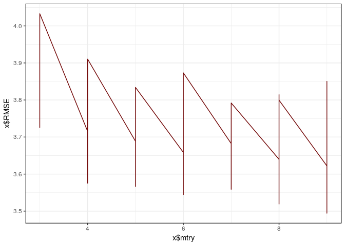
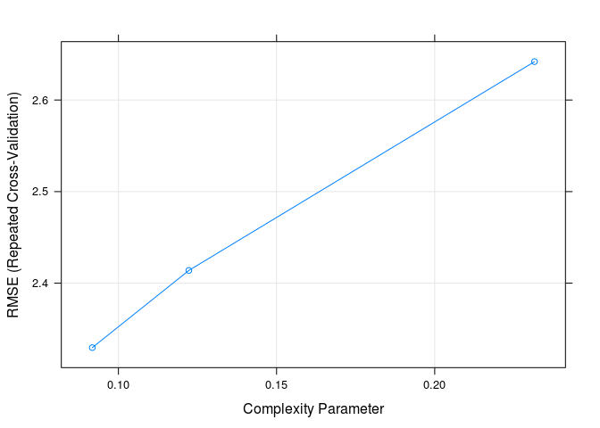
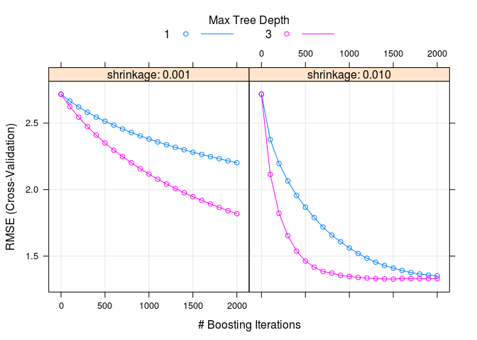

Homework 4: Bags, Forests, Boosts, oh my
================
Andrew Lerner
2/28/2019

``` r
library(tidyverse)
```

    ## ── Attaching packages ─────────────────────────────────────── tidyverse 1.2.1 ──

    ## ✔ ggplot2 3.0.0     ✔ purrr   0.2.5
    ## ✔ tibble  1.4.2     ✔ dplyr   0.7.6
    ## ✔ tidyr   0.8.1     ✔ stringr 1.3.1
    ## ✔ readr   1.1.1     ✔ forcats 0.3.0

    ## ── Conflicts ────────────────────────────────────────── tidyverse_conflicts() ──
    ## ✖ dplyr::filter() masks stats::filter()
    ## ✖ dplyr::lag()    masks stats::lag()

``` r
library(broom)
library(glmnet)
```

    ## Loading required package: Matrix

    ## 
    ## Attaching package: 'Matrix'

    ## The following object is masked from 'package:tidyr':
    ## 
    ##     expand

    ## Loading required package: foreach

    ## 
    ## Attaching package: 'foreach'

    ## The following objects are masked from 'package:purrr':
    ## 
    ##     accumulate, when

    ## Loaded glmnet 2.0-16

``` r
library(caret)
```

    ## Loading required package: lattice

    ## 
    ## Attaching package: 'caret'

    ## The following object is masked from 'package:purrr':
    ## 
    ##     lift

``` r
library(ISLR)
library(janitor)
library(stringr)
library(rpart)
library(rpart.plot)
library(partykit)
```

    ## Loading required package: grid

    ## Loading required package: libcoin

    ## Loading required package: mvtnorm

``` r
library(randomForest)
```

    ## randomForest 4.6-14

    ## Type rfNews() to see new features/changes/bug fixes.

    ## 
    ## Attaching package: 'randomForest'

    ## The following object is masked from 'package:dplyr':
    ## 
    ##     combine

    ## The following object is masked from 'package:ggplot2':
    ## 
    ##     margin

``` r
library(MASS)
```

    ## 
    ## Attaching package: 'MASS'

    ## The following object is masked from 'package:dplyr':
    ## 
    ##     select

``` r
library(gbm)
```

    ## Loading required package: survival

    ## 
    ## Attaching package: 'survival'

    ## The following object is masked from 'package:rpart':
    ## 
    ##     solder

    ## The following object is masked from 'package:caret':
    ## 
    ##     cluster

    ## Loading required package: splines

    ## Loading required package: parallel

    ## Loaded gbm 2.1.3

``` r
library(tree)
theme_set(theme_bw())
```

Problem 1
---------

Problem 7 from Chapter 8 in the text. To be specific, please use a sequence of `ntree` from 25 to 500 in steps of 25 and `mtry` from 3 to 9 for by 1.

In the lab, we applied random forests to the Boston data using mtry=6 and using ntree=25 and ntree=500. Create a plot displaying the test error resulting from random forests on this data set for a more comprehensive range of values for mtry and ntree. You can model your plot after Figure 8.10. Describe the results obtained.

Answer 1
--------

``` r
set.seed(1)
df <- tbl_df(Boston)
inTraining <- createDataPartition(df$medv, p = .75, list = F)
training <- df[inTraining, ]
testing  <- df[-inTraining, ]

# Since this problem was indicated as ungraded I wanted to submit the work I completed on it rather than copying your code from last night - I think I made significant progress (and worked hard on it) despite not getting all the way there. If you have any feedback on the way I went about this I'd love to hear, though if not no big deal as well. 

x <- data.frame(mtry = numeric(), RMSE = numeric(), tree = numeric())

for (a in training) {
  i = 0      
  rf_boston_cv <- train(medv ~ ., 
                  data = training,
                  method = "rf",
                  ntree = 25 + (i * 25),
                  importance = T,
                  tuneGrid = data.frame(mtry = 3:9))
  results <- rf_boston_cv$results[1:2]
  results$tree <- 25 + (i * 25)
  x <- rbind(x,results)
  i <- i + 1
  if(i == 19) {
    break}
}
x
```

    ##    mtry     RMSE tree
    ## 1     3 3.925760   25
    ## 2     4 3.715248   25
    ## 3     5 3.688495   25
    ## 4     6 3.658472   25
    ## 5     7 3.682346   25
    ## 6     8 3.639767   25
    ## 7     9 3.622010   25
    ## 8     3 3.832467   25
    ## 9     4 3.759623   25
    ## 10    5 3.722289   25
    ## 11    6 3.636862   25
    ## 12    7 3.710270   25
    ## 13    8 3.683201   25
    ## 14    9 3.681167   25
    ## 15    3 3.889044   25
    ## 16    4 3.812399   25
    ## 17    5 3.749688   25
    ## 18    6 3.691636   25
    ## 19    7 3.661516   25
    ## 20    8 3.685375   25
    ## 21    9 3.693733   25
    ## 22    3 3.785253   25
    ## 23    4 3.716592   25
    ## 24    5 3.638001   25
    ## 25    6 3.604539   25
    ## 26    7 3.582833   25
    ## 27    8 3.548679   25
    ## 28    9 3.611072   25
    ## 29    3 3.907895   25
    ## 30    4 3.780074   25
    ## 31    5 3.662607   25
    ## 32    6 3.623607   25
    ## 33    7 3.608094   25
    ## 34    8 3.603155   25
    ## 35    9 3.527477   25
    ## 36    3 3.725324   25
    ## 37    4 3.708006   25
    ## 38    5 3.617829   25
    ## 39    6 3.552402   25
    ## 40    7 3.558818   25
    ## 41    8 3.534772   25
    ## 42    9 3.518004   25
    ## 43    3 3.848229   25
    ## 44    4 3.638565   25
    ## 45    5 3.637395   25
    ## 46    6 3.594129   25
    ## 47    7 3.563991   25
    ## 48    8 3.571181   25
    ## 49    9 3.515745   25
    ## 50    3 4.029956   25
    ## 51    4 3.861009   25
    ## 52    5 3.803691   25
    ## 53    6 3.786519   25
    ## 54    7 3.772782   25
    ## 55    8 3.814518   25
    ## 56    9 3.850358   25
    ## 57    3 3.790918   25
    ## 58    4 3.680653   25
    ## 59    5 3.661716   25
    ## 60    6 3.676869   25
    ## 61    7 3.651999   25
    ## 62    8 3.733423   25
    ## 63    9 3.697787   25
    ## 64    3 3.847042   25
    ## 65    4 3.741236   25
    ## 66    5 3.663706   25
    ## 67    6 3.605803   25
    ## 68    7 3.564527   25
    ## 69    8 3.650135   25
    ## 70    9 3.571085   25
    ## 71    3 3.921220   25
    ## 72    4 3.766513   25
    ## 73    5 3.673378   25
    ## 74    6 3.674960   25
    ## 75    7 3.705592   25
    ## 76    8 3.670913   25
    ## 77    9 3.566867   25
    ## 78    3 3.882833   25
    ## 79    4 3.730771   25
    ## 80    5 3.673017   25
    ## 81    6 3.700646   25
    ## 82    7 3.680996   25
    ## 83    8 3.586038   25
    ## 84    9 3.652504   25
    ## 85    3 3.797846   25
    ## 86    4 3.575288   25
    ## 87    5 3.566275   25
    ## 88    6 3.544240   25
    ## 89    7 3.559352   25
    ## 90    8 3.519106   25
    ## 91    9 3.494386   25
    ## 92    3 4.032856   25
    ## 93    4 3.910294   25
    ## 94    5 3.833956   25
    ## 95    6 3.873215   25
    ## 96    7 3.791935   25
    ## 97    8 3.799470   25
    ## 98    9 3.774432   25

``` r
p <- ggplot(data = x, aes(x = x$mtry, y = x$RMSE))
p + geom_line(col = "#6E0000") + 
  theme_bw()
```



Problem 2
---------

Problem 8 from Chapter 8 in the text. Set your seed with 9823 and split into train/test using 50% of your data in each split. In addition to parts (a) - (e), do the following:

1.  Fit a gradient-boosted tree to the training data and report the estimated test MSE.
2.  Fit a multiple regression model to the training data and report the estimated test MSE
3.  Summarize your results.

Part A)

``` r
set.seed(9823)
df <- tbl_df(Carseats)
inTraining <- createDataPartition(df$Sales, p = .50, list = F)
training <- df[inTraining, ]
testing  <- df[-inTraining, ]
```

Part B)

Here we can see that if we have a good shelf location we are much more likely to make sale, where consumers may also be considering price and their education level has an impact. If we have a bad shelf location, our path is more difficult - if we have a low price we still have a good probability of making a sale, but if we have a high price consumers start to consider things such as our competitors' prices.

We can also see that the test MSE is 4.48

``` r
carseats_tree <- rpart(Sales ~ ., data = training)
summary(carseats_tree)
```

    ## Call:
    ## rpart(formula = Sales ~ ., data = training)
    ##   n= 201 
    ## 
    ##            CP nsplit rel error    xerror       xstd
    ## 1  0.23155949      0 1.0000000 1.0173468 0.09708974
    ## 2  0.12226232      1 0.7684405 0.8555409 0.07828876
    ## 3  0.09172973      2 0.6461782 0.7218100 0.06677113
    ## 4  0.03533612      3 0.5544484 0.6239798 0.05599835
    ## 5  0.03433475      4 0.5191123 0.7008466 0.06537458
    ## 6  0.03003688      5 0.4847776 0.7115057 0.06797243
    ## 7  0.02823833      6 0.4547407 0.6966850 0.06851981
    ## 8  0.02671147      7 0.4265024 0.7006259 0.06910021
    ## 9  0.02151143      8 0.3997909 0.6807879 0.06912370
    ## 10 0.01799895      9 0.3782795 0.7180768 0.07159743
    ## 11 0.01200941     11 0.3422816 0.7059585 0.06945401
    ## 12 0.01033541     12 0.3302722 0.7122929 0.07028484
    ## 13 0.01000000     13 0.3199367 0.7076406 0.07023507
    ## 
    ## Variable importance
    ##   ShelveLoc       Price   CompPrice         Age  Population   Education 
    ##          41          23          11           7           5           5 
    ## Advertising      Income 
    ##           4           4 
    ## 
    ## Node number 1: 201 observations,    complexity param=0.2315595
    ##   mean=7.465721, MSE=7.428204 
    ##   left son=2 (162 obs) right son=3 (39 obs)
    ##   Primary splits:
    ##       ShelveLoc   splits as  LRL,       improve=0.23155950, (0 missing)
    ##       Price       < 129.5 to the right, improve=0.13414320, (0 missing)
    ##       Advertising < 13.5  to the left,  improve=0.09155010, (0 missing)
    ##       Age         < 61.5  to the right, improve=0.05517630, (0 missing)
    ##       US          splits as  LR,        improve=0.03545178, (0 missing)
    ## 
    ## Node number 2: 162 observations,    complexity param=0.1222623
    ##   mean=6.822222, MSE=5.749911 
    ##   left son=4 (49 obs) right son=5 (113 obs)
    ##   Primary splits:
    ##       ShelveLoc   splits as  L-R,       improve=0.19597310, (0 missing)
    ##       Price       < 105.5 to the right, improve=0.18264610, (0 missing)
    ##       Advertising < 11.5  to the left,  improve=0.07161144, (0 missing)
    ##       Age         < 63.5  to the right, improve=0.05718564, (0 missing)
    ##       Income      < 116.5 to the left,  improve=0.04340843, (0 missing)
    ##   Surrogate splits:
    ##       CompPrice  < 93.5  to the left,  agree=0.704, adj=0.02, (0 split)
    ##       Population < 14.5  to the left,  agree=0.704, adj=0.02, (0 split)
    ## 
    ## Node number 3: 39 observations,    complexity param=0.03533612
    ##   mean=10.13872, MSE=5.534591 
    ##   left son=6 (13 obs) right son=7 (26 obs)
    ##   Primary splits:
    ##       Price       < 127.5 to the right, improve=0.2444267, (0 missing)
    ##       US          splits as  LR,        improve=0.1751606, (0 missing)
    ##       Advertising < 0.5   to the left,  improve=0.1675706, (0 missing)
    ##       Education   < 11.5  to the right, improve=0.1537685, (0 missing)
    ##       Population  < 356   to the left,  improve=0.1463307, (0 missing)
    ##   Surrogate splits:
    ##       Income    < 30.5  to the left,  agree=0.744, adj=0.231, (0 split)
    ##       CompPrice < 149   to the right, agree=0.718, adj=0.154, (0 split)
    ##       Age       < 34    to the left,  agree=0.718, adj=0.154, (0 split)
    ## 
    ## Node number 4: 49 observations,    complexity param=0.03003688
    ##   mean=5.210204, MSE=4.903508 
    ##   left son=8 (35 obs) right son=9 (14 obs)
    ##   Primary splits:
    ##       Price       < 102.5 to the right, improve=0.18665160, (0 missing)
    ##       Income      < 95.5  to the left,  improve=0.18458130, (0 missing)
    ##       Education   < 11.5  to the left,  improve=0.13839380, (0 missing)
    ##       Population  < 185.5 to the left,  improve=0.12645500, (0 missing)
    ##       Advertising < 11.5  to the left,  improve=0.07818734, (0 missing)
    ##   Surrogate splits:
    ##       CompPrice  < 112.5 to the right, agree=0.816, adj=0.357, (0 split)
    ##       Age        < 75.5  to the left,  agree=0.776, adj=0.214, (0 split)
    ##       Income     < 27    to the right, agree=0.755, adj=0.143, (0 split)
    ##       Population < 496.5 to the left,  agree=0.735, adj=0.071, (0 split)
    ## 
    ## Node number 5: 113 observations,    complexity param=0.09172973
    ##   mean=7.521239, MSE=4.501483 
    ##   left son=10 (73 obs) right son=11 (40 obs)
    ##   Primary splits:
    ##       Price       < 105.5 to the right, improve=0.26925010, (0 missing)
    ##       Income      < 57.5  to the left,  improve=0.11786330, (0 missing)
    ##       Age         < 60.5  to the right, improve=0.11445890, (0 missing)
    ##       Advertising < 6.5   to the left,  improve=0.09124711, (0 missing)
    ##       CompPrice   < 115.5 to the left,  improve=0.04636677, (0 missing)
    ##   Surrogate splits:
    ##       CompPrice  < 120.5 to the right, agree=0.699, adj=0.15, (0 split)
    ##       Population < 80    to the right, agree=0.681, adj=0.10, (0 split)
    ##       Income     < 118.5 to the left,  agree=0.664, adj=0.05, (0 split)
    ## 
    ## Node number 6: 13 observations
    ##   mean=8.493846, MSE=3.219254 
    ## 
    ## Node number 7: 26 observations,    complexity param=0.02671147
    ##   mean=10.96115, MSE=4.663056 
    ##   left son=14 (17 obs) right son=15 (9 obs)
    ##   Primary splits:
    ##       Education   < 11.5  to the right, improve=0.3289528, (0 missing)
    ##       CompPrice   < 120.5 to the left,  improve=0.2320853, (0 missing)
    ##       Advertising < 0.5   to the left,  improve=0.1510274, (0 missing)
    ##       Price       < 108.5 to the right, improve=0.1324465, (0 missing)
    ##       Population  < 312.5 to the left,  improve=0.1093973, (0 missing)
    ##   Surrogate splits:
    ##       CompPrice  < 135   to the left,  agree=0.769, adj=0.333, (0 split)
    ##       Price      < 93.5  to the right, agree=0.769, adj=0.333, (0 split)
    ##       Population < 416   to the left,  agree=0.731, adj=0.222, (0 split)
    ##       Income     < 36.5  to the right, agree=0.692, adj=0.111, (0 split)
    ## 
    ## Node number 8: 35 observations,    complexity param=0.02151143
    ##   mean=4.605143, MSE=3.748665 
    ##   left son=16 (27 obs) right son=17 (8 obs)
    ##   Primary splits:
    ##       CompPrice < 137.5 to the left,  improve=0.2447961, (0 missing)
    ##       Price     < 143.5 to the right, improve=0.1786213, (0 missing)
    ##       Education < 11.5  to the left,  improve=0.1692974, (0 missing)
    ##       Age       < 44    to the right, improve=0.1435586, (0 missing)
    ##       Income    < 58.5  to the right, improve=0.1297241, (0 missing)
    ##   Surrogate splits:
    ##       Income    < 41    to the right, agree=0.8, adj=0.125, (0 split)
    ##       Education < 17.5  to the left,  agree=0.8, adj=0.125, (0 split)
    ## 
    ## Node number 9: 14 observations
    ##   mean=6.722857, MSE=4.587249 
    ## 
    ## Node number 10: 73 observations,    complexity param=0.02823833
    ##   mean=6.706301, MSE=3.290895 
    ##   left son=20 (59 obs) right son=21 (14 obs)
    ##   Primary splits:
    ##       Advertising < 13.5  to the left,  improve=0.17550200, (0 missing)
    ##       Income      < 59    to the left,  improve=0.13442920, (0 missing)
    ##       CompPrice   < 121.5 to the left,  improve=0.13058810, (0 missing)
    ##       Age         < 48.5  to the right, improve=0.12723440, (0 missing)
    ##       Price       < 136   to the right, improve=0.04860137, (0 missing)
    ## 
    ## Node number 11: 40 observations,    complexity param=0.03433475
    ##   mean=9.0085, MSE=3.286838 
    ##   left son=22 (27 obs) right son=23 (13 obs)
    ##   Primary splits:
    ##       Age         < 50.5  to the right, improve=0.3899200, (0 missing)
    ##       CompPrice   < 117.5 to the left,  improve=0.3136527, (0 missing)
    ##       Advertising < 5.5   to the left,  improve=0.1404600, (0 missing)
    ##       Income      < 55    to the left,  improve=0.1330976, (0 missing)
    ##       Price       < 96.5  to the right, improve=0.1321742, (0 missing)
    ##   Surrogate splits:
    ##       CompPrice   < 125.5 to the left,  agree=0.775, adj=0.308, (0 split)
    ##       Population  < 32    to the right, agree=0.725, adj=0.154, (0 split)
    ##       Advertising < 17.5  to the left,  agree=0.700, adj=0.077, (0 split)
    ##       Education   < 16.5  to the left,  agree=0.700, adj=0.077, (0 split)
    ## 
    ## Node number 14: 17 observations
    ##   mean=10.06, MSE=3.393306 
    ## 
    ## Node number 15: 9 observations
    ##   mean=12.66333, MSE=2.630133 
    ## 
    ## Node number 16: 27 observations,    complexity param=0.01033541
    ##   mean=4.083704, MSE=2.696394 
    ##   left son=32 (10 obs) right son=33 (17 obs)
    ##   Primary splits:
    ##       Population < 171.5 to the left,  improve=0.21196320, (0 missing)
    ##       Price      < 139.5 to the right, improve=0.18986180, (0 missing)
    ##       Education  < 11.5  to the left,  improve=0.18936010, (0 missing)
    ##       Income     < 64.5  to the right, improve=0.15477380, (0 missing)
    ##       Age        < 42.5  to the right, improve=0.09996678, (0 missing)
    ##   Surrogate splits:
    ##       Advertising < 1.5   to the left,  agree=0.778, adj=0.4, (0 split)
    ##       Price       < 149.5 to the right, agree=0.741, adj=0.3, (0 split)
    ##       Education   < 16.5  to the right, agree=0.741, adj=0.3, (0 split)
    ##       Age         < 68.5  to the right, agree=0.704, adj=0.2, (0 split)
    ## 
    ## Node number 17: 8 observations
    ##   mean=6.365, MSE=3.285325 
    ## 
    ## Node number 20: 59 observations,    complexity param=0.01799895
    ##   mean=6.336102, MSE=2.802651 
    ##   left son=40 (18 obs) right son=41 (41 obs)
    ##   Primary splits:
    ##       CompPrice   < 121.5 to the left,  improve=0.13130470, (0 missing)
    ##       Age         < 27.5  to the right, improve=0.11301050, (0 missing)
    ##       Price       < 131.5 to the right, improve=0.08968463, (0 missing)
    ##       Income      < 59    to the left,  improve=0.08736340, (0 missing)
    ##       Advertising < 6.5   to the left,  improve=0.06259425, (0 missing)
    ##   Surrogate splits:
    ##       Price      < 114.5 to the left,  agree=0.831, adj=0.444, (0 split)
    ##       Income     < 111.5 to the right, agree=0.712, adj=0.056, (0 split)
    ##       Population < 31.5  to the left,  agree=0.712, adj=0.056, (0 split)
    ##       Age        < 32    to the left,  agree=0.712, adj=0.056, (0 split)
    ## 
    ## Node number 21: 14 observations
    ##   mean=8.266429, MSE=2.336937 
    ## 
    ## Node number 22: 27 observations
    ##   mean=8.222963, MSE=2.030821 
    ## 
    ## Node number 23: 13 observations
    ##   mean=10.64, MSE=1.952092 
    ## 
    ## Node number 32: 10 observations
    ##   mean=3.098, MSE=2.886056 
    ## 
    ## Node number 33: 17 observations
    ##   mean=4.663529, MSE=1.677093 
    ## 
    ## Node number 40: 18 observations
    ##   mean=5.420556, MSE=0.8434497 
    ## 
    ## Node number 41: 41 observations,    complexity param=0.01799895
    ##   mean=6.738049, MSE=3.133225 
    ##   left son=82 (16 obs) right son=83 (25 obs)
    ##   Primary splits:
    ##       Price       < 131.5 to the right, improve=0.24937500, (0 missing)
    ##       Age         < 48.5  to the right, improve=0.14544350, (0 missing)
    ##       Income      < 59    to the left,  improve=0.12444810, (0 missing)
    ##       Advertising < 6.5   to the left,  improve=0.07810302, (0 missing)
    ##       CompPrice   < 131.5 to the right, improve=0.05041991, (0 missing)
    ##   Surrogate splits:
    ##       CompPrice  < 140   to the right, agree=0.805, adj=0.500, (0 split)
    ##       Education  < 16.5  to the right, agree=0.683, adj=0.188, (0 split)
    ##       Income     < 114.5 to the right, agree=0.659, adj=0.125, (0 split)
    ##       Population < 437   to the right, agree=0.659, adj=0.125, (0 split)
    ## 
    ## Node number 82: 16 observations
    ##   mean=5.633125, MSE=2.359334 
    ## 
    ## Node number 83: 25 observations,    complexity param=0.01200941
    ##   mean=7.4452, MSE=2.347105 
    ##   left son=166 (7 obs) right son=167 (18 obs)
    ##   Primary splits:
    ##       Age         < 68    to the right, improve=0.30558290, (0 missing)
    ##       Advertising < 6     to the left,  improve=0.28734230, (0 missing)
    ##       Urban       splits as  LR,        improve=0.18450460, (0 missing)
    ##       Income      < 87.5  to the right, improve=0.10393110, (0 missing)
    ##       Price       < 121.5 to the right, improve=0.08411169, (0 missing)
    ##   Surrogate splits:
    ##       Income      < 101   to the right, agree=0.84, adj=0.429, (0 split)
    ##       Advertising < 1     to the left,  agree=0.80, adj=0.286, (0 split)
    ##       Population  < 384.5 to the right, agree=0.76, adj=0.143, (0 split)
    ## 
    ## Node number 166: 7 observations
    ##   mean=6.087143, MSE=0.8713061 
    ## 
    ## Node number 167: 18 observations
    ##   mean=7.973333, MSE=1.924867

``` r
prp(carseats_tree)
```


``` r
yhat <- predict(carseats_tree, newdata = testing)
mean((yhat - testing$Sales)^2)
```

    ## [1] 4.484515

Part C)

``` r
fit_control <- trainControl(method = "repeatedcv",
                           number = 10, 
                           repeats = 10)
carseats_tree <- train(Sales ~ ., 
                        data = training,
                        method = "rpart", 
                        trControl = fit_control)
```

    ## Warning in nominalTrainWorkflow(x = x, y = y, wts = weights, info =
    ## trainInfo, : There were missing values in resampled performance measures.

``` r
plot(carseats_tree)
```



``` r
plot(as.party(carseats_tree$finalModel))
```


Part D)

Using the bagged approach, the test MSE is now 4.48 - an improvement over our previous model. Price and shelf location are both still the most important variables here.

``` r
carseats_bag = randomForest(Sales ~ ., data = training, mtry = 10, ntree = 500, importance = TRUE)
carseats_bag
```

    ## 
    ## Call:
    ##  randomForest(formula = Sales ~ ., data = training, mtry = 10,      ntree = 500, importance = TRUE) 
    ##                Type of random forest: regression
    ##                      Number of trees: 500
    ## No. of variables tried at each split: 10
    ## 
    ##           Mean of squared residuals: 2.806514
    ##                     % Var explained: 62.22

``` r
test_preds <- predict(carseats_bag, newdata = testing)
carseats_testing2 <- testing %>%
  mutate(y_hat = test_preds,
         sq_err = (y_hat - Sales)^2)
mean(carseats_testing2$sq_err)
```

    ## [1] 3.01233

``` r
importance(carseats_bag)
```

    ##                %IncMSE IncNodePurity
    ## CompPrice   22.6185496    143.855110
    ## Income       9.2567908    121.148832
    ## Advertising 16.6155155    114.951929
    ## Population  -4.6528070     49.860973
    ## Price       45.8306316    337.974407
    ## ShelveLoc   54.7379270    499.686626
    ## Age         14.7732276    111.286436
    ## Education    5.4092444     52.277259
    ## Urban       -0.8916436      5.958605
    ## US           7.3136561     18.060014

Part E)

The test MSE decreased to 3.61, though price and shelf location remain the most important variables involved.

``` r
carseat_forest = randomForest(Sales ~ ., data = training, mtry = 3, ntree = 500, importance = TRUE)
carseat_forest
```

    ## 
    ## Call:
    ##  randomForest(formula = Sales ~ ., data = training, mtry = 3,      ntree = 500, importance = TRUE) 
    ##                Type of random forest: regression
    ##                      Number of trees: 500
    ## No. of variables tried at each split: 3
    ## 
    ##           Mean of squared residuals: 3.042829
    ##                     % Var explained: 59.04

``` r
test_preds2 <- predict(carseat_forest, newdata = testing)
carseats_test3 <- testing %>%
  mutate(y_hat = test_preds2,
         sq_err = (y_hat - Sales)^2)
mean(carseats_test3$sq_err)
```

    ## [1] 3.582751

``` r
importance(carseat_forest)
```

    ##                %IncMSE IncNodePurity
    ## CompPrice   12.3802765     133.69912
    ## Income       5.5089470     131.85388
    ## Advertising 14.2288465     135.91218
    ## Population  -0.2551009     103.05642
    ## Price       33.3916495     298.38175
    ## ShelveLoc   37.9969293     364.65946
    ## Age         10.3137537     138.96675
    ## Education   -0.3378721      67.56156
    ## Urban       -2.6355407      15.17345
    ## US           3.4718774      23.41715

Part F)

``` r
grid <- expand.grid(interaction.depth = c(1, 3), 
                    n.trees = seq(0, 2000, by = 100),
                    shrinkage = c(.01, 0.001),
                    n.minobsinnode = 10)
trainControl <- trainControl(method = "cv", number = 5)
carseat_gbm <- train(Sales ~ ., 
                    data = training, 
                    distribution = "gaussian", 
                    method = "gbm",
                    trControl = trainControl, 
                    tuneGrid = grid,
                    verbose = FALSE)
```

    ## Warning in nominalTrainWorkflow(x = x, y = y, wts = weights, info =
    ## trainInfo, : There were missing values in resampled performance measures.

``` r
carseat_gbm
```

    ## Stochastic Gradient Boosting 
    ## 
    ## 201 samples
    ##  10 predictor
    ## 
    ## No pre-processing
    ## Resampling: Cross-Validated (5 fold) 
    ## Summary of sample sizes: 161, 160, 161, 161, 161 
    ## Resampling results across tuning parameters:
    ## 
    ##   shrinkage  interaction.depth  n.trees  RMSE      Rsquared   MAE     
    ##   0.001      1                     0     2.717737        NaN  2.200709
    ##   0.001      1                   100     2.666348  0.3064183  2.163353
    ##   0.001      1                   200     2.621561  0.3241746  2.129575
    ##   0.001      1                   300     2.582299  0.3424138  2.101514
    ##   0.001      1                   400     2.546317  0.3575969  2.073636
    ##   0.001      1                   500     2.513901  0.3714618  2.046981
    ##   0.001      1                   600     2.484847  0.3861833  2.021886
    ##   0.001      1                   700     2.455597  0.3978042  1.997293
    ##   0.001      1                   800     2.429099  0.4087241  1.973548
    ##   0.001      1                   900     2.403943  0.4168172  1.951833
    ##   0.001      1                  1000     2.380982  0.4236514  1.931253
    ##   0.001      1                  1100     2.358814  0.4332248  1.912220
    ##   0.001      1                  1200     2.337561  0.4423677  1.892320
    ##   0.001      1                  1300     2.317826  0.4497504  1.875251
    ##   0.001      1                  1400     2.299638  0.4560254  1.858845
    ##   0.001      1                  1500     2.281559  0.4633681  1.842850
    ##   0.001      1                  1600     2.264580  0.4713977  1.827458
    ##   0.001      1                  1700     2.248172  0.4800338  1.812389
    ##   0.001      1                  1800     2.232146  0.4877859  1.798224
    ##   0.001      1                  1900     2.216417  0.4940769  1.784239
    ##   0.001      1                  2000     2.201893  0.5014777  1.770816
    ##   0.001      3                     0     2.717737        NaN  2.200709
    ##   0.001      3                   100     2.624270  0.5059676  2.125937
    ##   0.001      3                   200     2.545038  0.5237373  2.062359
    ##   0.001      3                   300     2.473454  0.5412382  2.006647
    ##   0.001      3                   400     2.410017  0.5559108  1.957050
    ##   0.001      3                   500     2.350754  0.5730313  1.909309
    ##   0.001      3                   600     2.296300  0.5850980  1.864943
    ##   0.001      3                   700     2.247958  0.5968466  1.824681
    ##   0.001      3                   800     2.201541  0.6088548  1.785000
    ##   0.001      3                   900     2.157654  0.6185375  1.748525
    ##   0.001      3                  1000     2.116719  0.6275323  1.713425
    ##   0.001      3                  1100     2.077683  0.6383250  1.680742
    ##   0.001      3                  1200     2.042164  0.6462857  1.650756
    ##   0.001      3                  1300     2.008449  0.6534848  1.622704
    ##   0.001      3                  1400     1.976520  0.6601167  1.596217
    ##   0.001      3                  1500     1.946669  0.6667915  1.572048
    ##   0.001      3                  1600     1.919025  0.6733320  1.549528
    ##   0.001      3                  1700     1.892195  0.6785348  1.527600
    ##   0.001      3                  1800     1.865964  0.6834081  1.505253
    ##   0.001      3                  1900     1.840761  0.6883922  1.484325
    ##   0.001      3                  2000     1.818427  0.6925200  1.465510
    ##   0.010      1                     0     2.717737        NaN  2.200709
    ##   0.010      1                   100     2.376877  0.4245858  1.931965
    ##   0.010      1                   200     2.196459  0.5108820  1.772227
    ##   0.010      1                   300     2.065214  0.5718087  1.657151
    ##   0.010      1                   400     1.955745  0.6184474  1.566341
    ##   0.010      1                   500     1.868461  0.6539024  1.505683
    ##   0.010      1                   600     1.789319  0.6777976  1.450910
    ##   0.010      1                   700     1.717754  0.6964258  1.394240
    ##   0.010      1                   800     1.657812  0.7126169  1.342895
    ##   0.010      1                   900     1.607665  0.7211168  1.301508
    ##   0.010      1                  1000     1.560586  0.7314694  1.266302
    ##   0.010      1                  1100     1.519115  0.7394627  1.230871
    ##   0.010      1                  1200     1.483895  0.7463149  1.201060
    ##   0.010      1                  1300     1.453642  0.7513222  1.177239
    ##   0.010      1                  1400     1.429106  0.7545735  1.156386
    ##   0.010      1                  1500     1.409354  0.7578984  1.141271
    ##   0.010      1                  1600     1.391801  0.7600231  1.129182
    ##   0.010      1                  1700     1.375557  0.7629038  1.114378
    ##   0.010      1                  1800     1.364923  0.7636579  1.107012
    ##   0.010      1                  1900     1.356900  0.7642406  1.101256
    ##   0.010      1                  2000     1.351642  0.7643608  1.097686
    ##   0.010      3                     0     2.717737        NaN  2.200709
    ##   0.010      3                   100     2.113999  0.6277880  1.714275
    ##   0.010      3                   200     1.821458  0.6939947  1.472063
    ##   0.010      3                   300     1.653111  0.7209377  1.332288
    ##   0.010      3                   400     1.537041  0.7389061  1.242530
    ##   0.010      3                   500     1.462986  0.7489462  1.184279
    ##   0.010      3                   600     1.416343  0.7540989  1.147429
    ##   0.010      3                   700     1.384150  0.7578098  1.122546
    ##   0.010      3                   800     1.372191  0.7581828  1.112861
    ##   0.010      3                   900     1.354738  0.7611911  1.097087
    ##   0.010      3                  1000     1.346845  0.7625606  1.088601
    ##   0.010      3                  1100     1.339177  0.7641549  1.080422
    ##   0.010      3                  1200     1.335307  0.7647900  1.075076
    ##   0.010      3                  1300     1.330701  0.7659671  1.069936
    ##   0.010      3                  1400     1.328025  0.7662621  1.068594
    ##   0.010      3                  1500     1.326513  0.7668691  1.066739
    ##   0.010      3                  1600     1.330416  0.7650206  1.069046
    ##   0.010      3                  1700     1.330511  0.7648351  1.068669
    ##   0.010      3                  1800     1.330314  0.7647293  1.068091
    ##   0.010      3                  1900     1.331087  0.7641056  1.066894
    ##   0.010      3                  2000     1.330046  0.7645520  1.065556
    ## 
    ## Tuning parameter 'n.minobsinnode' was held constant at a value of 10
    ## RMSE was used to select the optimal model using the smallest value.
    ## The final values used for the model were n.trees = 1500,
    ##  interaction.depth = 3, shrinkage = 0.01 and n.minobsinnode = 10.

``` r
plot(carseat_gbm)
```



``` r
test_preds3 <- predict(carseat_gbm, newdata = testing)
carseat_test4 <- testing %>%
  mutate(y_hat_gbm = test_preds3,
         sq_err_gbm = (y_hat_gbm - Sales)^2)
mean(carseat_test4$sq_err_gbm)
```

    ## [1] 1.765211

Part G)

``` r
carseat_lm = lm(Sales ~ ., data = training)
summary(carseat_lm)
```

    ## 
    ## Call:
    ## lm(formula = Sales ~ ., data = training)
    ## 
    ## Residuals:
    ##      Min       1Q   Median       3Q      Max 
    ## -2.73001 -0.74370  0.05735  0.70125  2.79990 
    ## 
    ## Coefficients:
    ##                   Estimate Std. Error t value Pr(>|t|)    
    ## (Intercept)      5.3719058  0.8813459   6.095 6.02e-09 ***
    ## CompPrice        0.0961630  0.0061210  15.710  < 2e-16 ***
    ## Income           0.0145521  0.0026568   5.477 1.36e-07 ***
    ## Advertising      0.1108655  0.0157793   7.026 3.74e-11 ***
    ## Population       0.0002349  0.0005417   0.434    0.665    
    ## Price           -0.0963392  0.0040825 -23.598  < 2e-16 ***
    ## ShelveLocGood    4.8395901  0.2283608  21.193  < 2e-16 ***
    ## ShelveLocMedium  1.9517284  0.1838631  10.615  < 2e-16 ***
    ## Age             -0.0450811  0.0048028  -9.386  < 2e-16 ***
    ## Education       -0.0198464  0.0292315  -0.679    0.498    
    ## UrbanYes         0.1770836  0.1634524   1.083    0.280    
    ## USYes           -0.2112815  0.2150752  -0.982    0.327    
    ## ---
    ## Signif. codes:  0 '***' 0.001 '**' 0.01 '*' 0.05 '.' 0.1 ' ' 1
    ## 
    ## Residual standard error: 1.049 on 189 degrees of freedom
    ## Multiple R-squared:  0.8608, Adjusted R-squared:  0.8527 
    ## F-statistic: 106.3 on 11 and 189 DF,  p-value: < 2.2e-16

``` r
test_preds4 <- predict(carseat_lm, newdata = testing)
carseat_test5 <- testing %>%
  mutate(y_hat_lm = test_preds4,
         sq_err_lm = (y_hat_lm - Sales)^2)
mean(carseat_test5$sq_err_lm)
```

    ## [1] 1.012709

Part H)

Summarize Results: Despite running a variety of more complicated models, our multiple linear regression model actually displayed the lowest test MSE at 1.01 - in addition to having the highest degree of interpretability of any model. It is the clear winner. That being said, the boosted gradient also did quite well with a test MSE of 1.76 and was a significant improvement over our other models (random forest, bagged tree, etc.) Price and shelf location remained our most important variables throughout, which should result in implementation of actionable business recommendations.
